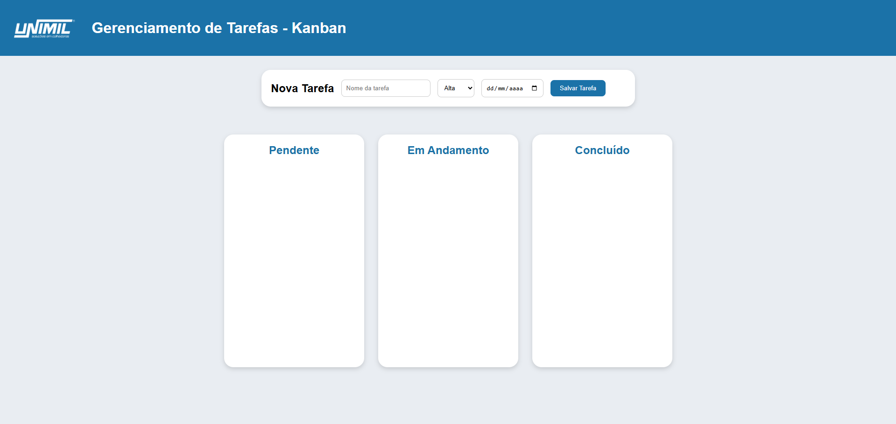

# Documento de Requisitos do Projeto

Nome do projeto: Sistema Kanban Unimil

Desenvolvido por: *Sophia Nader Forti* 

## Visão geral do sistema (Escopo)

  Durante um diálogo, foi identificada a necessidade de automatizar a metodologia Kanban que estava sendo utilizada pela fábrica de forma física/manual. Optamos por desenvolver o sistema via HTML pela praticidade e facilidade na integração com Banco de Dados.
 
  Desta forma, as pendências podem ser gerenciadas diretamente pelos setores de produção e administração de maneira conjunta, de modo que ambas as partes tenham acesso às alterações realizadas no quadro.

  O sistema permite o cadastro e gerenciamento de tarefas, que podem ter o status variado entre "Pendente", "Em andamento", e "Concluído".

## Requisitos Funcionais

RF01 - Cadastro de tarefas: O sistema deve permitir que o usuário cadastre uma nova tarefa informando, no mínimo, o nome da tarefa, o nível de prioridade e a data prevista para entrega.

RF02 - Visualização das tarefas: O sistema deve exibir as tarefas cadastradas em um quadro Kanban, permitindo a visualização de acordo com o status de cada tarefa.

RF03 - Classificação por status: O sistema deve classificar as tarefas nos status Pendente, Em Andamento e Concluído.

RF04 - Movimentação de tarefas: O sistema deve permitir que o usuário mova as tarefas entre as colunas do Kanban por meio do recurso de arrastar e soltar (Drag and Drop).

RF05 - Definição de prioridade: O sistema deve permitir que o usuário selecione a prioridade da tarefa entre os níveis Alta, Média e Baixa.

RF06 - Identificação visual de prioridade: O sistema deve apresentar uma identificação visual diferente para cada nível de prioridade da tarefa.

RF07 - Definição de prazo: O sistema deve permitir que o usuário informe uma data prevista para a entrega da tarefa.

RF08 - Identificação de tarefas atrasadas: O sistema deve exibir uma mensagem de "TAREFA ATRASADA" quando a data de entrega for ultrapassada e a tarefa permanecer com status Pendente ou Em Andamento.

RF09 - Edição de tarefas: O sistema deve permitir que o usuário edite as informações de uma tarefa já cadastrada.

RF10 - Exclusão de tarefas: O sistema deve permitir que o usuário exclua uma tarefa cadastrada, mediante confirmação da operação.

RF11 - Ordenação por prioridade: O sistema deve organizar as tarefas considerando seus níveis de prioridade, exibindo tarefas de prioridade Alta antes das tarefas de prioridade Média e Baixa.

RF12 - Persistência das tarefas: O sistema deve armazenar as tarefas cadastradas de forma que os dados permaneçam disponíveis após o usuário atualizar ou reabrir o sistema.

Requisitos previstos para a versão corporativa

RF13 - Autenticação de usuários: O sistema deve permitir que usuários cadastrados realizem login utilizando credenciais individuais.

RF14 - Cadastro de usuários: O sistema deve permitir o cadastro de usuários autorizados a utilizar o sistema.

RF15 - Encerramento de sessão: O sistema deve permitir que o usuário autenticado encerre a sessão por meio da funcionalidade de logout.

RF16 - Controle de acesso: O sistema deve permitir a definição de diferentes níveis de acesso conforme o perfil do usuário.

RF17 - Responsável pela tarefa: O sistema deve permitir a associação de um responsável a cada tarefa cadastrada.

RF18 - Registro de conclusão: O sistema deve registrar a data em que uma tarefa for alterada para o status Concluído.

RF19 - Histórico de movimentações: O sistema deve manter um histórico das principais alterações realizadas nas tarefas, incluindo mudanças de status.

RF20 - Compartilhamento dos dados: O sistema deve disponibilizar as mesmas informações atualizadas aos usuários autorizados que acessarem o sistema em diferentes computadores da rede corporativa.

## Requisitos Não Funcionais (RNF)

RNF01 - Usabilidade: O sistema deve possuir uma interface simples, intuitiva e de fácil utilização pelos colaboradores.

RNF02 - Identidade visual: O sistema deve utilizar uma interface visual compatível com a identidade da empresa, priorizando as cores azul e branco e a utilização do logotipo institucional.

RNF03 - Responsividade: O sistema deve adaptar sua interface a diferentes tamanhos de tela utilizados no ambiente corporativo, incluindo computadores e tablets.

RNF04 - Compatibilidade: O sistema deve funcionar corretamente nos principais navegadores utilizados pela empresa.

RNF05 - Desempenho: O sistema deve executar as operações de cadastro, edição, exclusão e movimentação das tarefas sem atrasos perceptíveis para o usuário em condições normais de utilização.

RNF06 - Persistência: Os dados cadastrados no sistema devem permanecer armazenados mesmo após o fechamento ou atualização da página.

RNF07 - Integridade dos dados: O sistema deve garantir que as alterações realizadas nas tarefas sejam armazenadas corretamente, evitando inconsistências entre o status apresentado e o status armazenado.

RNF08 - Segurança de autenticação: As credenciais dos usuários não devem ser armazenadas em texto simples, devendo ser protegidas por mecanismos adequados de segurança quando o sistema de autenticação for implementado.

RNF09 - Controle de acesso: O acesso às funcionalidades e informações do sistema deve ser permitido somente aos usuários devidamente autenticados e autorizados.

RNF10 - Segurança dos dados: O sistema deve adotar mecanismos que impeçam usuários não autorizados de acessar ou modificar dados corporativos.

RNF11 - Banco de dados: Na versão corporativa, as informações compartilhadas entre os usuários devem ser armazenadas em banco de dados centralizado, substituindo o LocalStorage como mecanismo principal de armazenamento.

RNF12 - Disponibilidade em rede: O sistema deve ser disponibilizado na infraestrutura da empresa de forma que possa ser acessado pelos dispositivos autorizados.

RNF13 - Concorrência: O sistema deve suportar o acesso simultâneo de múltiplos usuários sem causar perda ou inconsistência das informações.

RNF14 - Manutenibilidade: O código-fonte deve ser organizado e estruturado de maneira a facilitar futuras correções, atualizações e implementação de novas funcionalidades.

RNF15 - Escalabilidade: A arquitetura do sistema deve permitir a inclusão futura de novos usuários, setores, funcionalidades e volumes maiores de tarefas sem exigir a reconstrução completa da aplicação.

RNF16 - Confiabilidade: O sistema deve evitar perda de informações durante operações comuns, como criação, edição, exclusão e alteração do status das tarefas.

RNF17 - Recuperação de dados: A versão corporativa do sistema deve possuir uma estratégia de backup e recuperação das informações armazenadas.

RNF18 - Confirmação de operações críticas: Operações que possam resultar em perda de informações, como a exclusão de uma tarefa, devem solicitar confirmação do usuário antes da execução.

RNF19 - Padronização: A interface deve manter padrões consistentes de cores, botões, títulos, campos e cartões em todas as telas do sistema.

RNF20 - Legibilidade: Os textos, informações de prioridade, prazos, mensagens de atraso e demais elementos da interface devem apresentar contraste e tamanho adequados para facilitar a leitura.

## Regras de Negócio (RN)

RN01 - Status inicial: Toda nova tarefa cadastrada no sistema deve ser criada automaticamente com o status Pendente.

RN02 - Status das tarefas: Uma tarefa deve possuir apenas um dos seguintes status: Pendente, Em Andamento ou Concluído.

RN03 - Prioridade: Toda tarefa deve possuir um nível de prioridade definido entre Alta, Média ou Baixa.

RN04 - Ordenação por prioridade: As tarefas devem ser apresentadas preferencialmente na ordem de prioridade Alta, Média e Baixa dentro das respectivas colunas.

RN05 - Prazo de entrega: A data de entrega informada para uma tarefa deve representar o prazo previsto para sua conclusão.

RN06 - Identificação de atraso: Uma tarefa deve ser considerada atrasada quando sua data de entrega for anterior à data atual e o status permanecer como Pendente ou Em Andamento.

RN07 - Tarefa concluída: Uma tarefa com status Concluído não deve ser identificada como atrasada, mesmo que a data prevista para entrega tenha sido ultrapassada.

RN08 - Movimentação de tarefas: Ao mover uma tarefa entre as colunas do Kanban, o status armazenado da tarefa deve ser atualizado de acordo com a coluna de destino.

RN09 - Persistência das alterações: Toda criação, edição, exclusão ou alteração de status de uma tarefa deve ser armazenada após a operação.

RN10 - Exclusão de tarefa: Uma tarefa somente deve ser excluída após a confirmação do usuário.

RN11 - Edição de tarefa: A edição de uma tarefa não deve alterar automaticamente o status da tarefa.

RN12 - Nome obrigatório: Uma tarefa não deve ser cadastrada sem que um nome seja informado.

RN13 - Controle de usuários: Na versão corporativa, somente usuários cadastrados e autenticados poderão acessar o sistema.

RN14 - Credenciais individuais: Cada usuário deverá possuir credenciais próprias para acessar o sistema, não sendo permitido utilizar uma conta genérica compartilhada como mecanismo padrão de identificação.

RN15 - Permissões: As operações disponíveis ao usuário deverão respeitar o nível de acesso atribuído à conta, quando o controle de perfis for implementado.

RN16 - Registro de conclusão: Quando uma tarefa for movida para Concluído, o sistema deverá registrar a data de conclusão da atividade.

RN17 - Reabertura de tarefa: Caso uma tarefa concluída seja movida novamente para Pendente ou Em Andamento, a tarefa deverá voltar a ser considerada ativa e ficar novamente sujeita à regra de atraso.

RN18 - Histórico: Alterações relevantes nas tarefas, como mudança de status, deverão ser associadas à tarefa no histórico quando essa funcionalidade for implementada.

RN19 - Compartilhamento das tarefas: Na versão corporativa, as tarefas cadastradas deverão estar disponíveis para os usuários autorizados do sistema, independentemente do computador utilizado para acesso.

RN20 - Fonte oficial dos dados: Após a implantação do banco de dados corporativo, as informações armazenadas no banco deverão ser consideradas a fonte oficial dos dados do sistema, substituindo o LocalStorage como armazenamento definitivo.

## Restrições (RT)

RT01 - Tecnologias de interface: A interface do sistema deve ser desenvolvida utilizando HTML, CSS e JavaScript.

RT02 - Execução em navegador: O sistema deve ser acessado por meio de navegador web, sem exigir a instalação de um aplicativo específico nas estações dos usuários.

RT03 - Ambiente corporativo: A versão de produção do sistema deve ser executada dentro da infraestrutura autorizada pela empresa.

RT04 - Armazenamento temporário: Durante a fase de prototipação, o sistema poderá utilizar o LocalStorage do navegador para armazenamento das tarefas.

RT05 - Armazenamento em produção: O LocalStorage não deve ser utilizado como armazenamento definitivo na versão corporativa multiusuário, devendo ser substituído por um banco de dados centralizado.

RT06 - Backend: A versão corporativa deverá possuir uma camada de backend responsável pela comunicação entre a interface, autenticação, regras de acesso e banco de dados.

RT07 - Comunicação com o banco: O frontend não deve possuir acesso direto ao banco de dados, devendo realizar as operações por intermédio do backend/API.

RT08 - Autenticação: A autenticação dos usuários deve ser realizada pelo backend ou por um serviço de identidade corporativo aprovado pela empresa.

RT09 - Armazenamento de senhas: As senhas dos usuários não devem ser armazenadas diretamente no código-fonte, no JavaScript do navegador ou em texto simples no banco de dados.

RT10 - Controle de acesso: O sistema deve impedir que usuários não autenticados acessem diretamente funcionalidades ou dados protegidos.

RT11 - Rede: O acesso ao sistema deverá respeitar as políticas e restrições da rede corporativa.

RT12 - Compatibilidade: O sistema deve ser compatível com os navegadores oficialmente utilizados nos computadores da empresa.

RT13 - Banco de dados: A tecnologia de banco de dados escolhida para produção deve ser compatível com a infraestrutura e os padrões tecnológicos adotados pela empresa.

RT14 - Integridade dos dados: As operações de criação, edição, exclusão e movimentação das tarefas devem ser persistidas no banco de dados antes de serem consideradas concluídas na versão corporativa.

RT15 - Identificação das tarefas: Cada tarefa armazenada no banco de dados deverá possuir um identificador único.

RT16 - Identificação dos usuários: Cada usuário cadastrado deverá possuir um identificador único no sistema.

RT17 - Validação de dados: Os dados recebidos pelo backend deverão ser validados antes de serem armazenados no banco de dados.

RT18 - Proteção do código: Informações sensíveis, credenciais, senhas, chaves e dados de conexão não devem ficar expostos nos arquivos HTML, CSS ou JavaScript enviados ao navegador.

RT19 - Backup: O banco de dados utilizado em produção deverá seguir a política corporativa definida para backup e recuperação das informações.

RT20 - Implantação: A publicação da versão de produção deverá ocorrer em ambiente autorizado pela área responsável pela infraestrutura e tecnologia da empresa.

## Protótipo 

Link para visualização: https://kanban-unimil.vercel.app/ 

